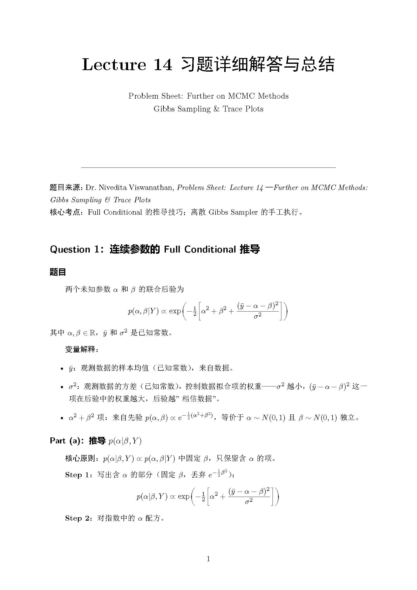
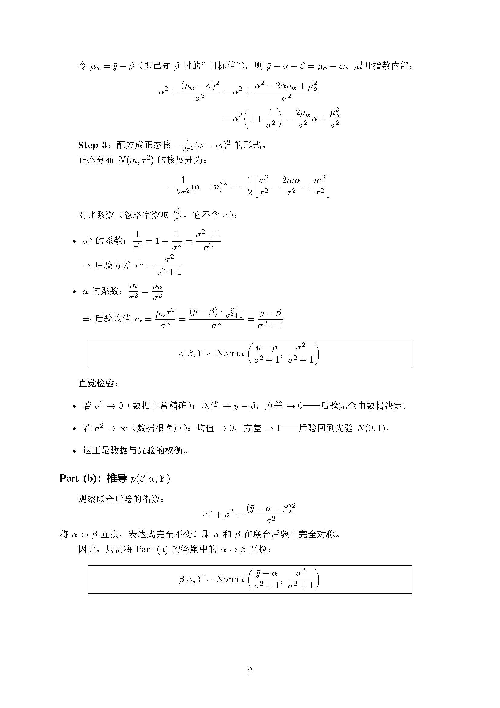
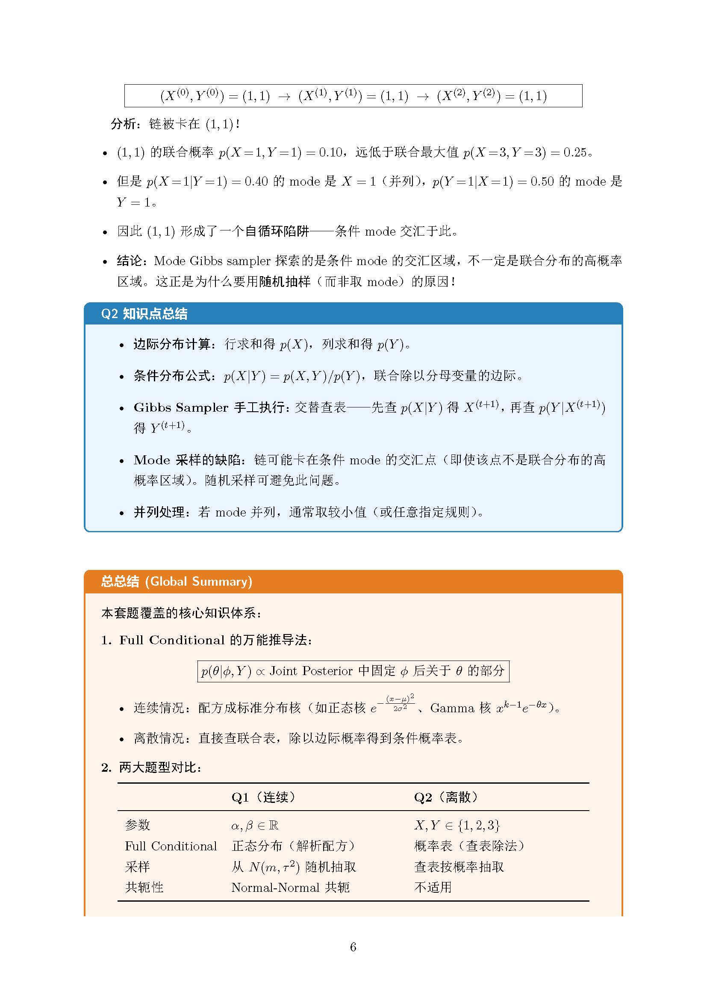
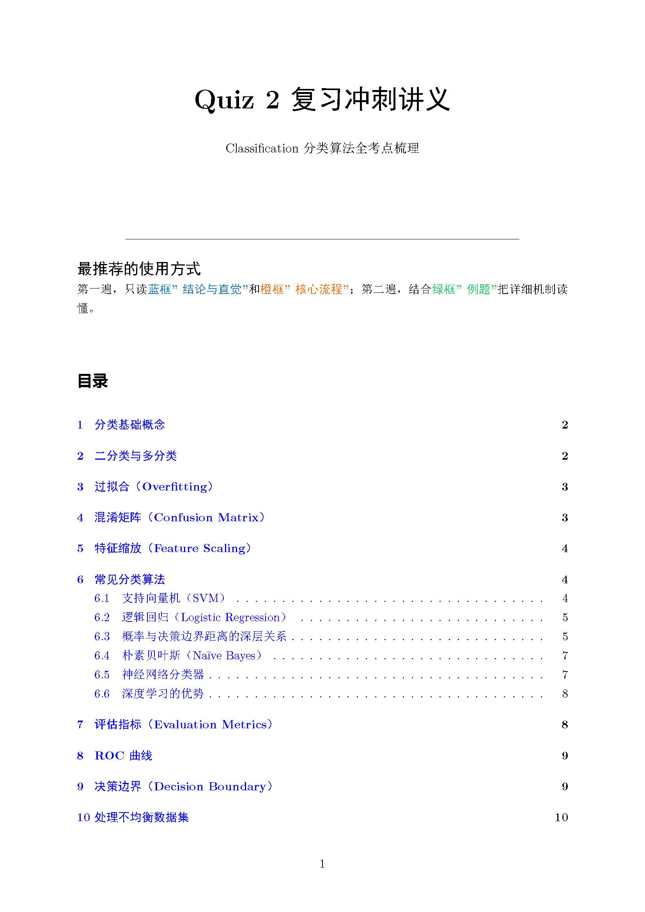
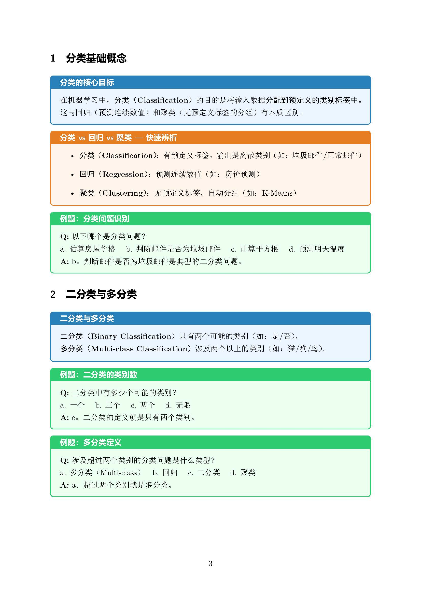
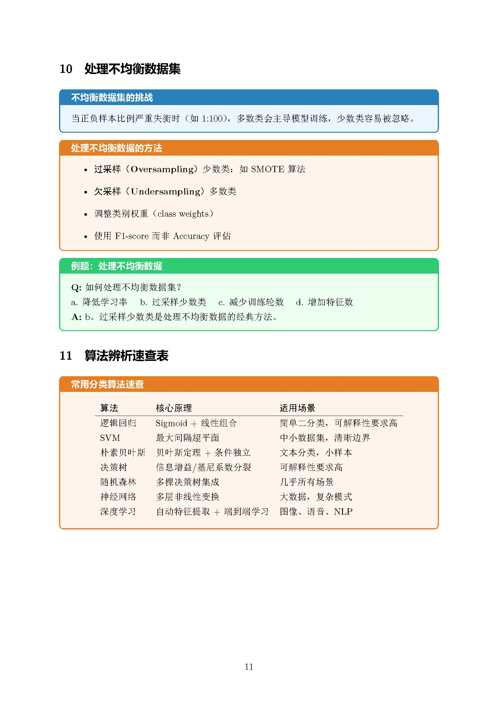

# StudySkills（ a chinese study tool ）

Two Claude Code skills for converting academic materials into beautifully formatted LaTeX PDF study guides.it mainly focus on turing studying materials in varises languages into chinese study assistant file but you can easily change the md file into other language

---

## exerpaper

Converts **problem sets** (PDF/PPTX) into a professional **solution manual** with:
- Step-by-step mathematical solutions for every sub-question
- Knowledge point summaries after each question
- A global topic summary at the end
- Green boxes for original question text, blue boxes for knowledge points, orange boxes for summaries

**Trigger:** `/exerpaper`

### Preview

| Cover & Overview | Detailed Solutions | Knowledge Summary |
|:---:|:---:|:---:|
|  |  |  |
| *overview* | *detailed solution* | *summery * |

---

## testpraper

Converts **lecture slides / quiz reviews** (PPTX or PDF) into a structured **exam sprint manual** with:
- Concepts in blue boxes, processes/steps in orange boxes, examples in green boxes
- Vivid real-world examples for abstract concepts
- Selective variable explanations for non-trivial math notation
- Table of contents and two-pass reading guide

**Trigger:** `/testpraper`

### Preview

| Title & TOC | Concept Boxes | Diagrams & Examples |
|:---:|:---:|:---:|
|  |  |  |
| *frontpage* | *information on knowledge* | *TikZ solution +example exercise* |

---

## Installation

Copy the `exerpaper/` and `testpraper/` folders into your Claude Code skills directory:

```bash
# User-level skills
https://github.com/kkkkkkdddddd/studyskills.git
cp -r exerpaper/ ~/.claude/skills/exerpaper/
cp -r testpraper/ ~/.claude/skills/testpraper/
```

Or place them in a project's `.claude/skills/` directory.

## Usage

```
/exerpaper path/to/problems.pdf
/testpraper path/to/slides.pptx
/testpraper "paste your raw text here"
```

## Dependencies

- **XeLaTeX** — for PDF compilation (`xelatex` command)
- **ctex** LaTeX package — for Chinese text support
- **tcolorbox** — for colored information boxes
- **pdf-converter skill** (`/pdf-converter`) — used internally by exerpaper to extract text from PDFs

## Output Format

Both skills produce:
- A `.tex` source file
- A compiled `.pdf`
- Intermediate files are automatically cleaned up

## Folder Structure

```
studyskill/
├── README.md
├── .gitignore
├── exerpaper/
│   ├── SKILL.md
│   └── examples/
│       ├── page1.jpg / page2.jpg / page6.jpg   # Preview images
│       ├── Problems Sheet.pdf                   # Input example
│       ├── ProblemsSheet_Solutions.pdf          # Output example
│       └── ProblemsSheet_Solutions.tex          # Output source
└── testpraper/
    ├── SKILL.md
    └── examples/
        ├── page1.jpg / page3.jpg / page11.jpg   # Preview images
        ├── Quiz 2_ ...pdf                       # Input example
        ├── quiz2_classification.pdf             # Output example
        └── quiz2_classification.tex             # Output source
```
